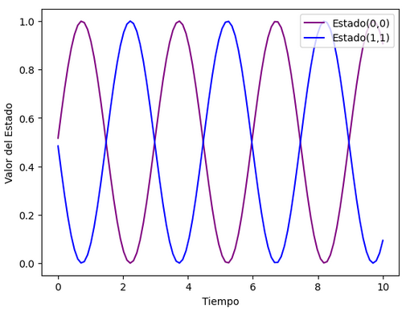

# Tutorial   
Utilizando las ecuaciones anteriores podremos programarlas para poder realizar la visualizacion de la evolucion temporal siguiendo los siguientes pasos:  
Dado:  

- yInit=[[0 1][1 0]]
- oOper=[[1 0][0 0]]

Primeramente hay que declarar distintas variables utilizando numpy:

1. Declarar un arreglo `tiempo` (utlizando .linspace) de 0 a 10 separado por un intervalo de su preferencia
2. Encontrar el valor de h correpondiente a la diferencia de un tiempo(n) y un tiempo(n+1)
3. Declarar `stateQuant00` y `stateQuant11` con dimensiones igual a tiempo lleno de un valor inical "0"

Utilizando las variables anteriores con el siguiente template calcula la evolucion temporal a partir del estado Inicial yInit:

    for tt in range(times.size):
    # Guarde el valor de las entradas (0,0) y (1,1) en los arreglos que definimos  
    # Obtenga estos valores de las entradas de yInit  
    # Código aquí ->  

    # Invoque rk4 operando sobre yInit  
    # y devuelva el resultado a un nuevo yN  
    # Código aquí ->  

    # Ahora asignamos yN a yInit  
    # De esta manera, en la siguiente iteración, el operador de esta iteración se convierte en el inicial  
    # de la siguiente iteración  
    # Código aquí ->

 Finalmente si se grafican las evoluciones temporales de los estados cuanticos obtenidos anteriormente con respecto al tiempo deberia dar una grafica similar a:

